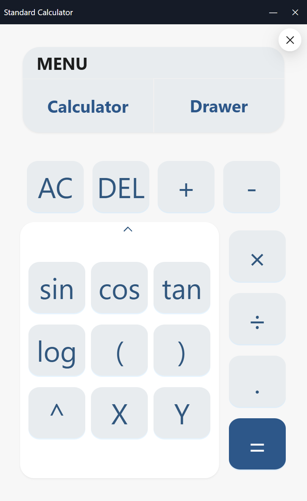
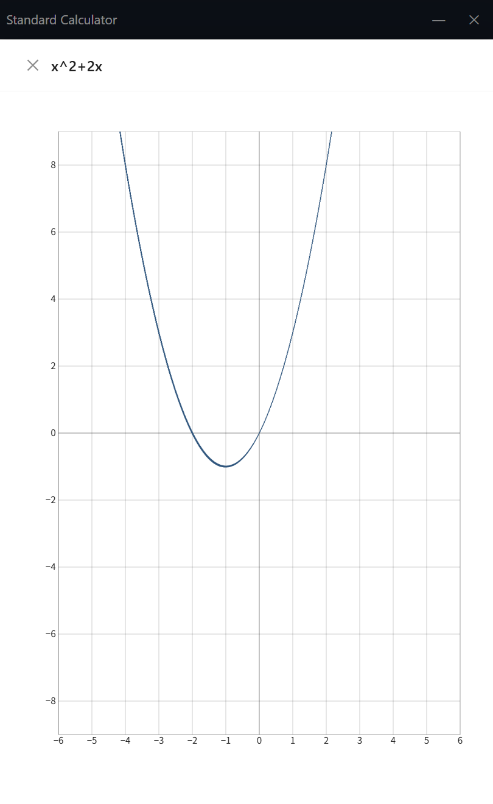

# Standard Calculator2

一个基于 Electron、React 和 TypeScript 开发的现代化标准计算器应用程序，具有数学计算和函数绘图功能。

## 功能特点

### 1. 基础计算器功能
- 基本运算：加、减、乘、除
- 高级数学函数：三角函数（sin, cos, tan）、对数函数（ln, lg）、幂运算等
- 常数支持：π（圆周率）、e（自然常数）
- 表达式计算：支持括号和复杂表达式计算
- 特殊功能：AC（全部清除）、DEL（删除最后一个字符）、复制结果

### 2. 函数绘图功能
- 数学函数图像绘制：使用[function-plot](https://github.com/mauriciopoppe/function-plot) 函数图像绘制库绘制各种数学函数图像
- 实时预览：输入函数表达式后可实时查看图像
- 交互式界面：支持缩放和平移查看图像细节

### 3. 诗词展示功能
- 古诗词展示：在计算器界面背面展示中国古诗词
- 诗词来源：集成[一言·古诗词 API](https://github.com/xenv/gushici?tab=readme-ov-file)，获取经典诗词内容
- 复制功能：可一键复制当前显示的诗词内容

### 4. 界面特色
- 卡片翻转设计：主界面采用卡片翻转效果，正面为计算器，背面为诗词展示
- 菜单导航：通过菜单可在计算器和绘图功能间切换
- 固定大小窗口：无边框窗口设计，支持最小化和关闭操作

## 技术栈

- **Electron**: 跨平台桌面应用框架(electron-vite)
- **React**: 前端用户界面库
- **TypeScript**: JavaScript的超集，提供类型安全
- **Ant Design**: UI组件库
- **mathjs**: 数学计算库，用于表达式解析和计算
- **function-plot**: 函数图像绘制库
- **react-card-flip**: 卡片翻转动画效果
- **react-router-dom**: 页面路由管理
- **framer-motion**: 页面切换动画

## 应用截图

<p align='center'>




</p>


## 使用说明

### 计算器功能
1. 点击数字和运算符按钮输入表达式
2. 点击"="按钮计算结果
3. 点击卡片可翻转到背面查看古诗词
4. 点击左上角菜单按钮可在不同功能间切换

### 绘图功能
1. 在输入区域输入函数表达式（变量为x）
2. 点击"√"按钮打开绘图窗口
3. 查看绘制的函数图像

## 开发相关

### 项目设置

```bash
# 安装依赖
$ npm install
```
### 开发模式

```bash
# 启动开发模式
$ npm run dev
```
### 打包

```bash
$ npm run build

# 构建 Windows 应用
$ npm run build:win

# 构建 macOS 应用
$ npm run build:mac

# 构建 Linux 应用
$ npm run build:linux
```
