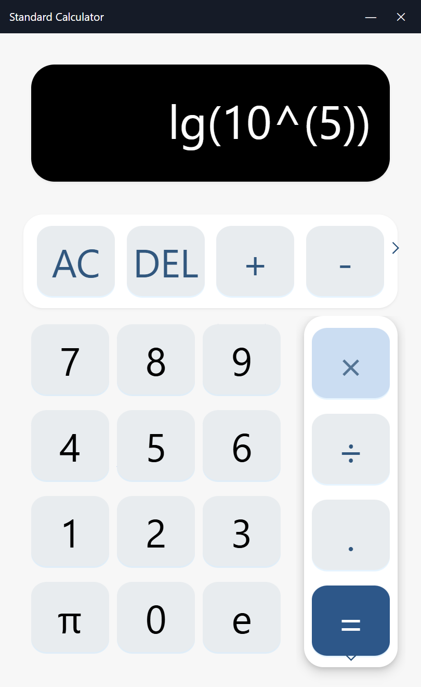
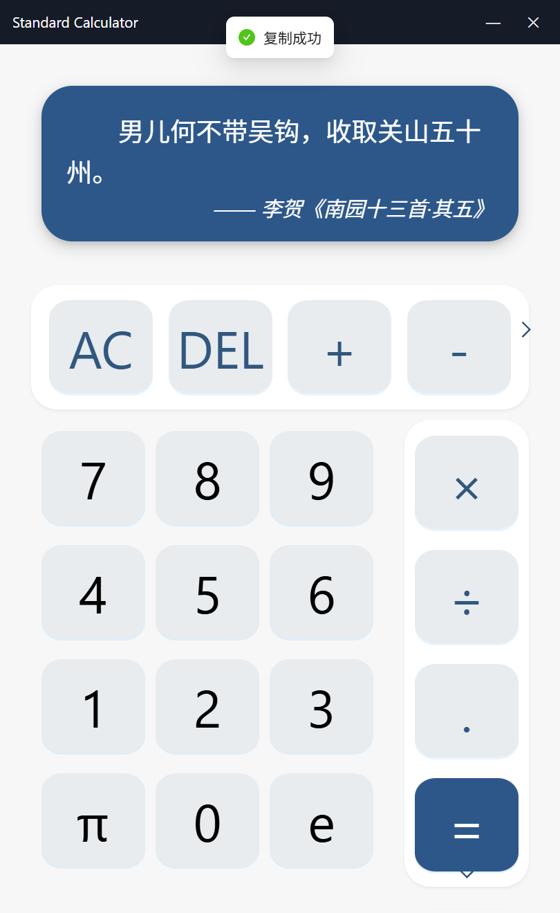

# react-elct

An Electron application with React and TypeScript

## Recommended IDE Setup

- [VSCode](https://code.visualstudio.com/) + [ESLint](https://marketplace.visualstudio.com/items?itemName=dbaeumer.vscode-eslint) + [Prettier](https://marketplace.visualstudio.com/items?itemName=esbenp.prettier-vscode) + [React]() + [electron]()

## Screenshot
<p align='center'>



</p>

## Project Setup

### Install

```bash
$ npm install
```

### Development

```bash
$ npm run dev
```
